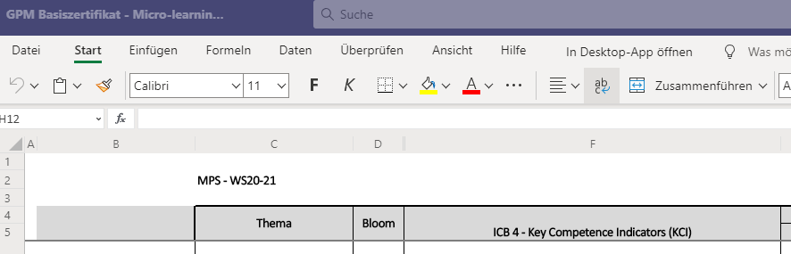

# Kursaufbau und Einführung

## Testbereich

Hier werden ein paar Tests gemacht.

### Screenshot mit `CTRL-V` einfügen

### Tabbox mit Infobox drinnen



Hier ist ein bisschen was interessantes :-p


hier ein kleiner Hinweis - das ist huebsch.

* erstens
* drittens
* drölftens




Hier ist ein kleiner Inhalt



### Youtube Video einfügen

Hier kann man einfach den Link reinkopieren, dann wird das automatisch eingebettet.



Gut - Youtube Video geht auch.

